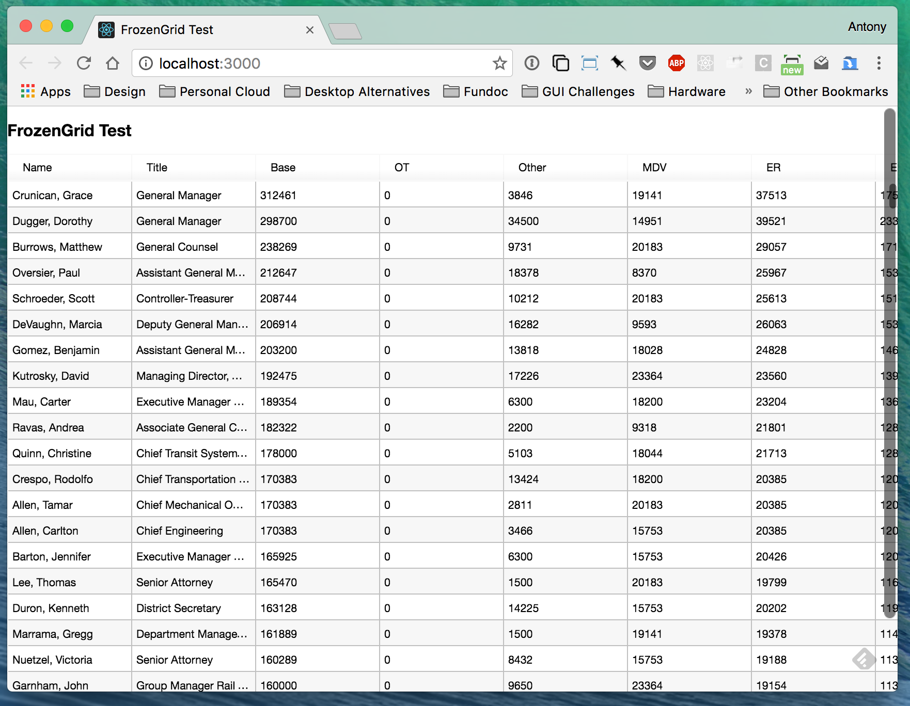
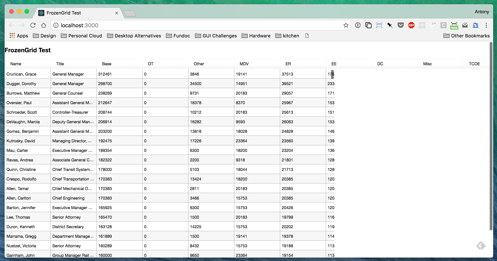
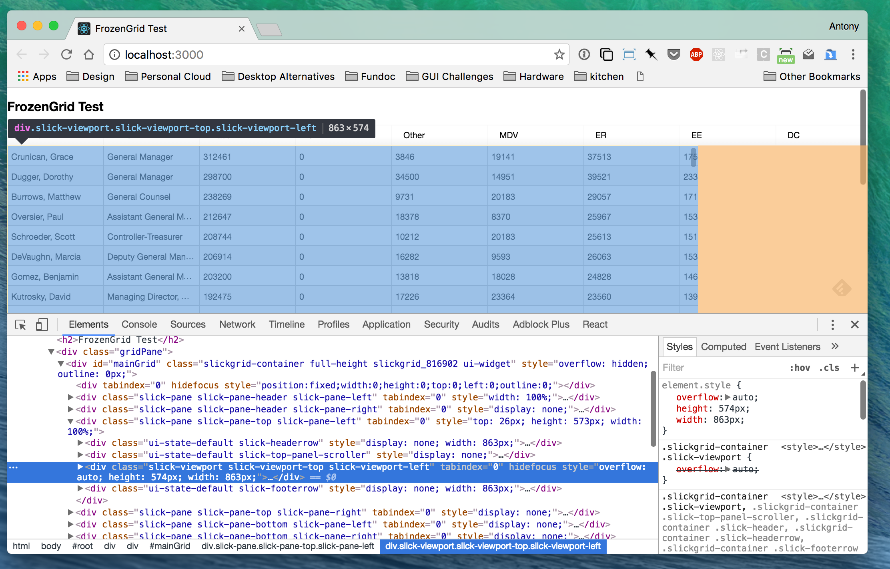
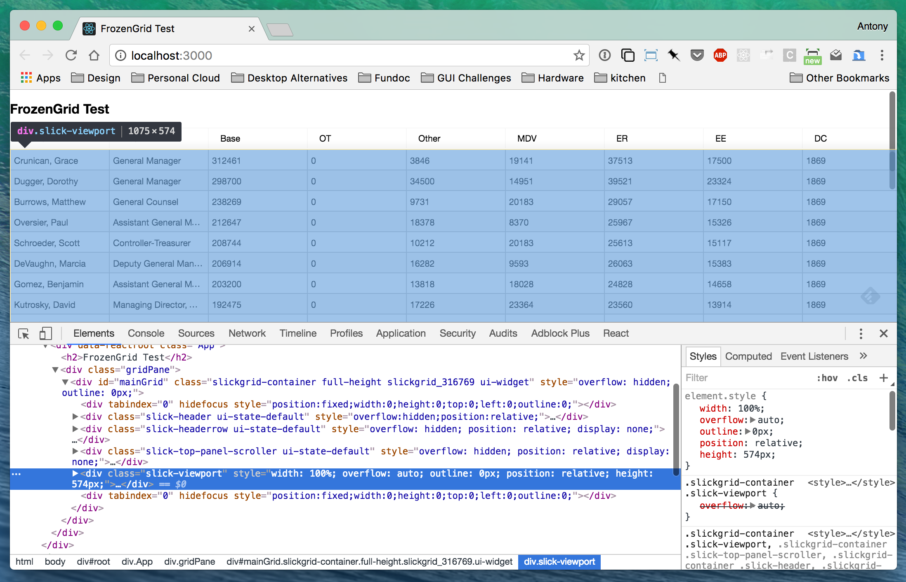

# FrozenGridTest

This repository contains a minimal example to demonstrate a sizing issue with `FrozenGrid` from [slickgrid-es6](https://github.com/DimitarChristoff/slickgrid-es6).

This project was created with [create-react-app](https://github.com/facebookincubator/create-react-app), but then 'ejected' in order to add `less` support needed by slickgrid-es6.

## Building and running

First install project dependencies:

```
$ yarn install
```

To run:

```
$ yarn start
```

## Resize Issue

This project was created to demonstrate differences in resize behavior between `Slick.Grid` and `Slick.FrozenGrid` from [slickgrid-es6](https://github.com/DimitarChristoff/slickgrid-es6)

The first issue I've been able to reproduce relates to resize behavior.
The CSS in this test project includes the following:

```
* {
  box-sizing: border-box;
}
```

Running `yarn start`, the initial view looks something like this:



If we enlarge the browser window, the grid viewport does not adjust to the new size:



The newer version of SlickGrid also included in `slickgrid-es6` available as `Slick.Grid` does not exhibit this issue.

Digging in a little, it looks like it may be difference in how the grids are setting up the `slick-viewport` div.  The FrozenGrid `slick-viewport` looks like this:



The `Slick.Grid` `slick-viewport` has a slightly different set of element.style properties:



I encountered this issue only indirectly because I noticed an issue when using FrozenGrid with Bootstrap; took some digging to identify box-sizing as the trigger. But this seems to be a broadly accepted / recommended practice -- see [here](https://www.paulirish.com/2012/box-sizing-border-box-ftw/) and [here](http://stackoverflow.com/questions/18854259/why-did-bootstrap-3-switch-to-box-sizing-border-box/18858771).
